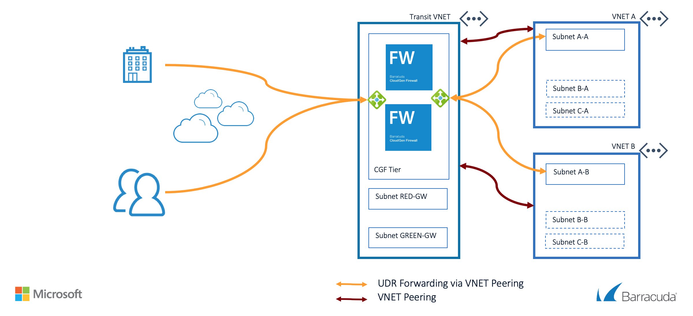

# Barracuda CloudGen Firewall 8.0 for Azure - High Availability Cluster with VNET Peering

**Note** This ARM Template uses version 8.0 of the CGF. Barracuda CloudGen Firewall version 8.0 is a cloud-only version. It is currently not available for on-premises deployments and can only be deployed in Microsoft Azure, Amazon Web Services, or Google Cloud Platform public clouds.

## Introduction

This reference architecture extends the the High Availability Cluster reference architecture building block with the capability to have multiple peered VNET's. The VNET containing the Barracuda CloudGen Firewall will act as the transit VNET where all communication between peered VNET's, Internet and on-premise networks connected via VPN or ExpressRoute will be inspected by the different deep packet inspection modules in the CloudGen Firewall.

This template creates a full setup with 3 different VNET's; 1 Transit Hub VNET and 2 Spoke VNET's. Automatically all required VNET peering and 

## Prerequisites

The solution does a check of the template when you use the provided scripts. It does require that [Programmatic Deployment](https://azure.microsoft.com/en-us/blog/working-with-marketplace-images-on-azure-resource-manager/) is enabled for the Barracuda CloudGen Firewall BYOL or PAYG images. Barracuda recommends use of **D**, **D_v2**, **F** or newer series. For the automatic configuration using the REST API, Ansible is required. Ansible is deployed within the Azure Cloud Shell by default.

## Deployed resources

Following resources will be created by the template:
- One Azure Hub VNET with 3 subnets (1 for the CGF, additional subnets for a red and green subnet)
- Two Azure Spoke VNET with 1 subnet each for servers
- Four route tables that will route all traffic for external and towards the other internal networks to the Barracuda CGF, including the Spoke subnets
- One internal standard Azure Load Balancer as the default gateway for all traffic that needs inspection
- One external standard Azure Load Balancer containing the deployed virtual machines with a public IP and services for IPSEC and TINA VPN tunnels available
- Two Barracuda CloudGen Firewall virtual machines with 1 network interface each and public IP
- Both CGF systems are deployed in an Availability Set

After deployment of the CGF cluster the script will also configure the Barracuda CGF units. It uses the REST API and Ansible to deploy this.  

**Note** Additional backend subnets and resources are *not* automatically created by the template. This has to be done manually after template deployment has finished or by adapting the ARM template.

## Deployment

Deployment of the ARM template is possible via the Azure Portal or Azure CLI. When deploying via the Azure Portal the CGF will not be configured using Ansible.
The package provides a deploy.sh for Azure CLI based deployments. This can be performed from the Azure Portal as well as the any system that has either of these scripting infrastructures installed. Or you can deploy from the Azure Portal using the provided link.

### Azure CLI

To deploy via Azure Cloud Shell you can connect via the Azure Portal or directly to [https://shell.azure.com/](https://shell.azure.com/). 

- Start up Azure Cloud Shell from the Azure Portal or go directly to [https://shell.azure.com](https://shell.azure.com/)
- Download the latest version of the ARM templates in the persistent clouddrive:

`cd ~/clouddrive/ && wget -qO- https://github.com/jvhoof/ngf-azure-templates/archive/master.zip | jar x && cd ~/clouddrive/ngf-azure-templates-master/Quickstart-CGF-VNET-Peering/ && ./deploy.sh`

- Answer the questions asked by the script on the following variables: location, prefix and password.

## Next Steps

Administration of the Barracuda CloudGen Firewall appliance is typically done with a Windows-based client application called as [Barracuda CloudGen Firewall Admin](https://dlportal.barracudanetworks.com/#/search).

Note: The username to login to the appliance is root and the password is the one configured during deployment. Also, a forward for TCP/807 and TCP-UDP/691 endpoints will be created automatically when you deploy this VM.

## Post Deployment Configuration

**Note** This configuration is handled by the Ansible configuration script after deployment.

It is also recommended you harden management access by enabling multifactor or key authentication and by restricting access to management interface using Management ACL: [How to Change the Root Password and Management ACL](https://campus.barracuda.com/product/cloudgenfirewall/doc/53248329/how-to-change-the-root-password-and-management-acl)

## Template Parameters
| Parameter Name | Description
|---|---
adminPassword | Password for the Firewall Admin tool
prefix | identifying prefix for all VM's being build. e.g WeProd would become WeProd-VM-CGF (Max 19 char, no spaces, [A-Za-z0-9]
vNetAddressSpace | Network range of the VNET (e.g. 172.16.136.0/22)
subnetCGF | Network range of the subnet containing the CloudGen Firewall (e.g. 172.16.136.0/24)
subnetRed | Network range of the red subnet (e.g. 172.16.137.0/24)
subnetGreen | Network range of the green subnet (e.g. 172.16.138.0/24)
vNetAddressSpaceSpoke1 | Network range of the VNET Spoke 1 (e.g. 172.16.140.0/23)
vNetAddressSpaceSpoke2 | Network range of the VNET Spoke 2 (e.g. 172.16.142.0/23)
subnetSpoke1 | Network range of the spoke1 subnet (e.g. 172.16.140.0/24)
subnetSpoke2 | Network range of the spoke2 subnet (e.g. 172.16.142.0/24)
imageSKU | SKU Hourly (PAYG) or BYOL (Bring your own license)
vmSize | Size of the VMs to be created
ccManaged | Is this instance managed via a CloudGen Firewall Control Center (Yes/No)
ccClusterName | The name of the cluster of this instance in the CloudGen Firewall Control Center
ccRangeId | The range location of this instance in the CloudGen Firewall Control Center
ccIpAddress | IP address of the CloudGen Firewall Control Center
ccSecret | Secret to retrieve the configuration from the CloudGen Firewall Control Center